# Component Hierarchy

## Overview

All Expo Router routes (`/`, `/projects/[projectId]`, `/projects/[projectId]/sessions/[sessionId]`) re-export the same `App` component. Global state is managed via **Jotai atoms** (no React Context). Real-time data flows through **StreamDB** (`@tanstack/react-db` live queries). Layout branches between phone (`SessionScreen`) and iPad landscape (`SplitLayout`) based on `useLayout()`.

## Component Tree

```mermaid
graph TD
    RootLayout["<b>RootLayout</b><br/><i>app/_layout.tsx</i>"]
    Slot["Slot <i>(Expo Router)</i>"]
    App["<b>App</b><br/><i>App.tsx</i>"]

    RootLayout -->|"Suspense boundary"| Slot
    Slot -->|"matched route"| App

    %% ── App branches ──
    App -->|"settingsVisible"| SettingsScreen
    App -->|"settingsVisible"| ModelSelectorSheet_Settings["ModelSelectorSheet<br/><i>(settings context)</i>"]
    App -->|"sessionId exists"| SessionContent
    App -->|"newSessionProjectId"| NewSessionContent
    App -->|"no session selected"| EmptySession
    App -->|"left sidebar"| SessionsSidebar
    App -->|"right sidebar"| ProjectsSidebar

    %% ── SettingsScreen children ──
    SettingsScreen["<b>SettingsScreen</b><br/><i>SettingsScreen.tsx</i>"]
    SectionHeader["SectionHeader <i>x4</i>"]
    ConnectionStatusBadge["ConnectionStatusBadge"]
    SettingsRow["SettingsRow <i>x2</i>"]
    Switch["Switch"]
    DropdownPicker["DropdownPicker"]
    AutoRecordBehavior["AutoRecordBehavior"]
    BehaviorItem["BehaviorItem <i>x3</i>"]

    SettingsScreen --> SectionHeader
    SettingsScreen --> ConnectionStatusBadge
    SettingsScreen --> SettingsRow
    SettingsRow --> Switch
    SettingsRow --> DropdownPicker
    SettingsScreen --> AutoRecordBehavior
    AutoRecordBehavior --> BehaviorItem

    %% ── ModelSelectorSheet children ──
    ModelSelectorSheet_Settings --> SectionLabel_MS["SectionLabel"]
    ModelSelectorSheet_Settings --> ModelRow["ModelRow <i>xN</i>"]

    %% ── SessionContent ──
    SessionContent["<b>SessionContent</b><br/><i>SessionContent.tsx</i>"]
    SessionLoading["SessionLoading"]
    ExistingSessionDataLoader["ExistingSessionDataLoader"]

    SessionContent -->|"loading"| SessionLoading
    SessionContent -->|"loaded"| ExistingSessionDataLoader
    ExistingSessionDataLoader --> SessionView

    %% ── SessionLoading children ──
    SessionLoading --> SessionHeader_SL["SessionHeader"]
    SessionLoading --> TabBar_SL["TabBar"]
    SessionLoading --> VoiceInputArea_SL["VoiceInputArea"]

    %% ── NewSessionContent ──
    NewSessionContent["<b>NewSessionContent</b><br/><i>SessionContent.tsx</i>"]
    NewSessionContent --> SessionView

    %% ── SessionView ──
    SessionView["<b>SessionView</b><br/><i>SessionContent.tsx</i>"]
    ModelSelectorSheet_SV["ModelSelectorSheet<br/><i>(session context)</i>"]

    SessionView -->|"isTabletLandscape"| SplitLayout
    SessionView -->|"phone"| SessionScreen
    SessionView --> ModelSelectorSheet_SV
    ModelSelectorSheet_SV --> SectionLabel_SV["SectionLabel"]
    ModelSelectorSheet_SV --> ModelRow_SV["ModelRow <i>xN</i>"]

    %% ── SessionScreen (phone) ──
    SessionScreen["<b>SessionScreen</b><br/><i>SessionScreen.tsx</i>"]
    SessionHeader_SS["SessionHeader"]
    TabBar_SS["TabBar"]
    ChatThread_SS["ChatThread"]
    ChangesView_SS["ChangesView"]
    VoiceInputArea_SS["VoiceInputArea"]

    SessionScreen --> SessionHeader_SS
    SessionScreen --> TabBar_SS
    SessionScreen -->|"tab = session"| ChatThread_SS
    SessionScreen -->|"tab = changes"| ChangesView_SS
    SessionScreen --> VoiceInputArea_SS

    %% ── SplitLayout (iPad) ──
    SplitLayout["<b>SplitLayout</b><br/><i>SplitLayout.tsx</i>"]
    ChangesView_SL["ChangesView<br/><i>(left panel)</i>"]
    TabBar_SL2["TabBar"]
    ChatThread_SL["ChatThread<br/><i>(right panel)</i>"]
    VoiceInputArea_SL2["VoiceInputArea"]
    SettingsScreen_SL["SettingsScreen<br/><i>(modal)</i>"]

    SplitLayout --> ChangesView_SL
    SplitLayout --> TabBar_SL2
    SplitLayout --> ChatThread_SL
    SplitLayout --> VoiceInputArea_SL2
    SplitLayout -->|"settings modal"| SettingsScreen_SL

    %% ── ChatThread children ──
    ToolCallBlock["ToolCallBlock"]
    ToolOutputBlock["ToolOutputBlock"]
    AgentStatusIndicator["AgentStatusIndicator"]
    UserMessageBubble["UserMessageBubble"]
    AssistantMessageBubble["AssistantMessageBubble"]
    StreamdownRN["StreamdownRN<br/><i>(3rd party)</i>"]

    ChatThread_SS --> ToolCallBlock
    ChatThread_SS --> ToolOutputBlock
    ChatThread_SS --> AgentStatusIndicator
    ChatThread_SS --> UserMessageBubble
    ChatThread_SS --> AssistantMessageBubble
    AssistantMessageBubble --> StreamdownRN

    ChatThread_SL --> ToolCallBlock
    ChatThread_SL --> ToolOutputBlock
    ChatThread_SL --> AgentStatusIndicator
    ChatThread_SL --> UserMessageBubble
    ChatThread_SL --> AssistantMessageBubble

    %% ── ChangesView children ──
    FileRow["FileRow <i>xN</i>"]
    DiffWebView["DiffWebView"]

    ChangesView_SS --> FileRow
    ChangesView_SS --> DiffWebView
    ChangesView_SL --> FileRow
    ChangesView_SL --> DiffWebView

    %% ── EmptySession ──
    EmptySession["<b>EmptySession</b><br/><i>EmptySession.tsx</i>"]
    SessionHeader_ES["SessionHeader"]
    TabBar_ES["TabBar"]
    VoiceInputArea_ES["VoiceInputArea"]

    EmptySession --> SessionHeader_ES
    EmptySession --> TabBar_ES
    EmptySession --> VoiceInputArea_ES

    %% ── SessionsSidebar ──
    SessionsSidebar["<b>SessionsSidebar</b><br/><i>SessionsSidebar.tsx</i>"]
    SessionListContent["SessionListContent"]
    SessionRow["SessionRow <i>xN</i>"]
    SessionStatusDot["SessionStatusDot"]

    SessionsSidebar --> SessionListContent
    SessionListContent --> SessionRow
    SessionRow --> SessionStatusDot

    %% ── ProjectsSidebar ──
    ProjectsSidebar["<b>ProjectsSidebar</b><br/><i>ProjectsSidebar.tsx</i>"]
    ProjectCard["ProjectCard <i>xN</i>"]

    ProjectsSidebar --> ProjectCard

    %% ── Styling ──
    classDef root fill:#1a1a2e,stroke:#e94560,color:#fff,stroke-width:2px
    classDef branch fill:#16213e,stroke:#0f3460,color:#fff
    classDef leaf fill:#0f3460,stroke:#533483,color:#fff
    classDef thirdparty fill:#533483,stroke:#e94560,color:#fff

    class RootLayout,App root
    class SessionContent,NewSessionContent,SessionView,SessionScreen,SplitLayout,SettingsScreen,SessionsSidebar,ProjectsSidebar branch
    class ToolCallBlock,ToolOutputBlock,AgentStatusIndicator,UserMessageBubble,AssistantMessageBubble,FileRow,DiffWebView,SessionHeader_SS,TabBar_SS,VoiceInputArea_SS,SessionHeader_ES,TabBar_ES,VoiceInputArea_ES,SessionRow,SessionStatusDot,ProjectCard,SectionHeader,ConnectionStatusBadge,SettingsRow,Switch,DropdownPicker,AutoRecordBehavior,BehaviorItem,ModelRow,SectionLabel_MS,SectionLabel_SV,ModelRow_SV,ModelSelectorSheet_Settings,ModelSelectorSheet_SV,EmptySession,SessionLoading,SessionHeader_SL,TabBar_SL,VoiceInputArea_SL,ChangesView_SS,ChangesView_SL,ChatThread_SS,ChatThread_SL,TabBar_SL2,VoiceInputArea_SL2,SettingsScreen_SL,SessionListContent leaf
    class StreamdownRN thirdparty
```

## Props Flow

```mermaid
graph TD
    subgraph Jotai["Jotai Atoms <i>(global state)</i>"]
        serverUrlAtom["serverUrlAtom<br/><code>string</code>"]
        debouncedServerUrlAtom["debouncedServerUrlAtom<br/><code>string</code>"]
        connectionInfoAtom["connectionInfoAtom<br/><code>ConnectionInfo</code>"]
        selectedModelAtom["selectedModelAtom<br/><code>ModelSelection | null</code>"]
        modelCatalogAtom["modelCatalogAtom<br/><code>CatalogModel[] | null</code>"]
        apiClientAtom["apiClientAtom<br/><code>ApiClient</code>"]
        pinnedSessionIdsAtom["pinnedSessionIdsAtom<br/><code>string[]</code>"]
        leftSidebarOpenAtom["leftSidebarOpenAtom<br/><code>boolean</code>"]
        rightSidebarOpenAtom["rightSidebarOpenAtom<br/><code>boolean</code>"]
        newSessionProjectIdAtom["newSessionProjectIdAtom<br/><code>string | null</code>"]
        handsFreeAutoRecordAtom["handsFreeAutoRecordAtom<br/><code>boolean</code>"]
        notificationSoundAtom["notificationSoundAtom<br/><code>NotificationSound</code>"]
        projectFilterAtom["projectFilterAtom<br/><code>string | null</code>"]
    end

    subgraph Hooks["Custom Hooks"]
        useSettings["useSettings()<br/>→ serverUrl, connection,<br/>handsFreeAutoRecord, notificationSound,<br/>appVersion"]
        useModels["useModels()<br/>→ selectedModel, catalog,<br/>defaults, getDefaultModel"]
        useAudioRecorder["useAudioRecorder()<br/>→ recordingState,<br/>startRecording, stopRecording"]
        useLayout["useLayout()<br/>→ isTabletLandscape, width, height"]
        useStateQuery["useStateQuery()<br/>→ sessions, messages, changes, projects"]
    end

    serverUrlAtom --> useSettings
    debouncedServerUrlAtom --> useSettings
    connectionInfoAtom --> useSettings
    handsFreeAutoRecordAtom --> useSettings
    notificationSoundAtom --> useSettings
    selectedModelAtom --> useModels
    modelCatalogAtom --> useModels
    apiClientAtom --> useModels

    subgraph App_Component["App"]
        direction TB
        App_Node["Reads: useSettings, useModels,<br/>useLayout, useLocalSearchParams,<br/>pinnedSessionIdsAtom, apiClientAtom,<br/>newSessionProjectIdAtom"]
    end

    useSettings --> App_Node
    useModels --> App_Node
    useLayout --> App_Node

    App_Node -->|"serverUrl, connection,<br/>handsFreeAutoRecord,<br/>notificationSound, appVersion,<br/>defaultModel, onBack"| SettingsScreen_P["SettingsScreen"]
    App_Node -->|"visible, catalog,<br/>selectedModel,<br/>onSelectModel, defaultModel"| ModelSelectorSheet_P["ModelSelectorSheet"]
    App_Node -->|"sessionId, isTabletLandscape,<br/>onMenuPress, onProjectsPress,<br/>settings: SessionSettings"| SessionContent_P["SessionContent"]
    App_Node -->|"projectId, isTabletLandscape,<br/>onMenuPress, onProjectsPress,<br/>onSessionCreated,<br/>settings: SessionSettings"| NewSessionContent_P["NewSessionContent"]
    App_Node -->|"onMenuPress, onProjectsPress"| EmptySession_P["EmptySession"]
    App_Node -->|"projectId, selectedSessionId,<br/>onClose, onNewSession,<br/>onSelectSession,<br/>onSettingsPress"| SessionsSidebar_P["SessionsSidebar"]
    App_Node -->|"selectedProjectId, onClose,<br/>onSelectProject, onNewSession"| ProjectsSidebar_P["ProjectsSidebar"]

    subgraph SessionContent_Flow["SessionContent → SessionView"]
        SC_Node["SessionContent<br/>fetches session via useStateQuery"]
        ESDL_Node["ExistingSessionDataLoader<br/>fetches messages + changes,<br/>reads apiClientAtom + selectedModelAtom"]
        SV_Node["SessionView<br/>reads useModels, useAudioRecorder"]
    end

    SessionContent_P --> SC_Node
    SC_Node -->|"session, sessionId,<br/>isTabletLandscape,<br/>onMenuPress, onProjectsPress,<br/>settings"| ESDL_Node
    ESDL_Node -->|"sessionId, session,<br/>serverMessages: Message[],<br/>changes: ChangedFile[],<br/>isTabletLandscape,<br/>onMenuPress, onProjectsPress,<br/>settings, onSendText,<br/>onSendAudio, onAbort,<br/>sessionModelInfo"| SV_Node

    SV_Node -->|"<b>phone path</b><br/>sessionId, session,<br/>messages, changes,<br/>activeTab, onTabChange,<br/>onMenuPress, onProjectsPress,<br/>onSend, isSending,<br/>audioRecorder, onAbort,<br/>modelName, onModelPress"| SessionScreen_P2["SessionScreen"]

    SV_Node -->|"<b>tablet path</b><br/>sessionId, session,<br/>messages, changes,<br/>onMenuPress, onProjectsPress,<br/>onSend, isSending,<br/>audioRecorder, onAbort,<br/>settings, modelName,<br/>onModelPress"| SplitLayout_P["SplitLayout"]

    SessionScreen_P2 -->|"projectName, branchName,<br/>relativeTime, onMenuPress,<br/>onProjectsPress"| SessionHeader_F["SessionHeader"]
    SessionScreen_P2 -->|"activeTab, onTabChange"| TabBar_F["TabBar"]
    SessionScreen_P2 -->|"messages, onToolCallPress"| ChatThread_F["ChatThread"]
    SessionScreen_P2 -->|"sessionId, changes"| ChangesView_F["ChangesView"]
    SessionScreen_P2 -->|"textValue, onTextChange,<br/>onSend, isSending,<br/>onMicPressIn, onMicPressOut,<br/>recordingState, modelName,<br/>sessionStatus, onAbort,<br/>onModelPress"| VoiceInputArea_F["VoiceInputArea"]

    ChatThread_F -->|"toolName, description, onPress"| ToolCallBlock_F["ToolCallBlock"]
    ChatThread_F -->|"content"| ToolOutputBlock_F["ToolOutputBlock"]
    ChatThread_F -->|"status"| AgentStatusIndicator_F["AgentStatusIndicator"]
    ChatThread_F -->|"content, isVoice, syncStatus"| UserMessageBubble_F["UserMessageBubble"]
    ChatThread_F -->|"content, isComplete"| AssistantMessageBubble_F["AssistantMessageBubble"]
    AssistantMessageBubble_F -->|"content, theme, isComplete"| StreamdownRN_F["StreamdownRN"]

    ChangesView_F -->|"file, isExpanded, onPress"| FileRow_F["FileRow"]
    ChangesView_F -->|"sessionId, activeFile"| DiffWebView_F["DiffWebView"]

    SessionsSidebar_P -->|"projectId, selectedSessionId,<br/>onSelectSession"| SessionListContent_F["SessionListContent"]
    SessionListContent_F -->|"session, isSelected, isPinned,<br/>sessionStatus, onPress,<br/>onTogglePin, onArchive,<br/>hasChildren, isExpanded"| SessionRow_F["SessionRow"]
    SessionRow_F -->|"status"| SessionStatusDot_F["SessionStatusDot"]

    ProjectsSidebar_P -->|"project, index, isSelected,<br/>onPress, onOverflow"| ProjectCard_F["ProjectCard"]

    %% ── Direct atom reads (bypassing prop drilling) ──
    connectionInfoAtom -.->|"direct read"| SessionHeader_F
    debouncedServerUrlAtom -.->|"direct read"| DiffWebView_F
    apiClientAtom -.->|"direct read"| DiffWebView_F
    pinnedSessionIdsAtom -.->|"direct read"| SessionListContent_F
    apiClientAtom -.->|"direct read"| SessionListContent_F
    projectFilterAtom -.->|"direct read"| ProjectsSidebar_P

    classDef atom fill:#2d1b69,stroke:#7c3aed,color:#fff
    classDef hook fill:#1e3a5f,stroke:#3b82f6,color:#fff
    classDef component fill:#1a1a2e,stroke:#e94560,color:#fff
    classDef leaf fill:#0f3460,stroke:#533483,color:#fff

    class serverUrlAtom,debouncedServerUrlAtom,connectionInfoAtom,selectedModelAtom,modelCatalogAtom,apiClientAtom,pinnedSessionIdsAtom,leftSidebarOpenAtom,rightSidebarOpenAtom,newSessionProjectIdAtom,handsFreeAutoRecordAtom,notificationSoundAtom,projectFilterAtom atom
    class useSettings,useModels,useAudioRecorder,useLayout,useStateQuery hook
    class App_Node,SC_Node,ESDL_Node,SV_Node component
    class SettingsScreen_P,ModelSelectorSheet_P,SessionContent_P,NewSessionContent_P,EmptySession_P,SessionsSidebar_P,ProjectsSidebar_P,SessionScreen_P2,SplitLayout_P,SessionHeader_F,TabBar_F,ChatThread_F,ChangesView_F,VoiceInputArea_F,ToolCallBlock_F,ToolOutputBlock_F,AgentStatusIndicator_F,UserMessageBubble_F,AssistantMessageBubble_F,StreamdownRN_F,FileRow_F,DiffWebView_F,SessionListContent_F,SessionRow_F,SessionStatusDot_F,ProjectCard_F leaf
```

## Key Types

| Type | Definition | Used By |
|---|---|---|
| `SessionSettings` | `{ serverUrl, setServerUrl, connection, handsFreeAutoRecord, ..., appVersion }` | App → SessionContent → SessionView → SplitLayout |
| `UIMessage` | `{ id, sessionId, role, type, content, syncStatus, isComplete, ... }` | SessionView → ChatThread → message bubbles |
| `SessionValue` | `{ id, title, directory, projectID, status, parentID?, summary?, ... }` | SessionContent → SessionView → SessionScreen/SplitLayout |
| `ChangedFile` | `{ path, status, added, removed }` | SessionView → ChangesView → FileRow |
| `ConnectionInfo` | `{ status, latencyMs, error }` | useSettings → App → SettingsScreen; atom → SessionHeader |
| `ModelSelection` | `{ providerID, modelID }` | useModels → App → ModelSelectorSheet |
| `RecordingState` | `'idle' \| 'recording'` | useAudioRecorder → SessionView → VoiceInputArea |

## Architecture Notes

- **Routing**: All Expo Router routes re-export `App`, which reads `useLocalSearchParams()` for `projectId`/`sessionId`.
- **State**: Jotai atoms for global state (no React Context). Persisted atoms use `AsyncStorage`.
- **Data**: Real-time data via StreamDB (`@durable-streams/state`) consumed through `useLiveQuery`.
- **Layout**: `useLayout()` detects iPad landscape → `SplitLayout` (side-by-side). Phone → `SessionScreen` (tabbed).
- **Sidebars**: Animated overlay drawers triggered by edge swipe or header buttons.
- **Direct atom reads**: `SessionHeader`, `DiffWebView`, `SessionListContent`, and `ProjectsSidebar` read atoms directly (shown as dashed lines in the props flow diagram), bypassing the prop-drilling chain.
